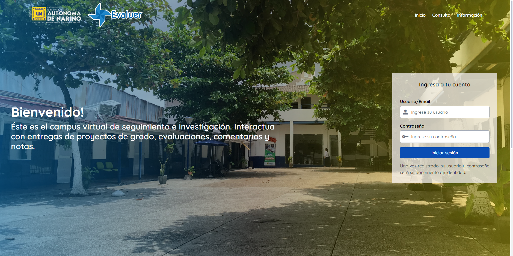

# Evaluer

Sistema web para el control y seguimiento de proyectos de investigación de la Corporación Universitaria Autónoma de Nariño.

## Tecnologías requeridas

-   MySql
-   PHP 8+
-   Laravel 9+
-   Node.js 16+

## Instalación

1. Clone este repositorio: `git clone https://github.com/mercadosergio/evaluer-blade.git`.
2. Este proyecto utiliza como motor de base de datos MySql, por ende debe crear una.
3. En la carpeta raíz del repositorio local, agregue un archivo que llevará por nombre `.env`, y configure las variables de entorno, siguiendo las que se muestran en el archivo `.env.example`. Muy importante colocar sus credenciales de mysql y el nombre de la base de datos, y asignar un API_KEY.
4. Luego de que todo lo anterior este configurado, deberá migrar las tablas y toda la configuración de infraestructura de la base de datos ejecutando en la consola `php artisan migrate`, y para insertar datos semilla de ejemplo deberá ejecutar la siguiente linea `php artisan db:seed`
5. Este proyecto utiliza dependencias de Nodejs para cargar assets, templates y demás herramientas, por ende, ejecute `npm run dev` en la consola.
6. Para ejecutar el software de forma local, ejecute `php artisan serve`.

## Credenciales

1. Credenciales estudiante:

-   Username: 0987654321
-   Password: 0987654321

2. Credenciales asesor:

-   Username: 1234567891
-   Password: 1234567891

3. Credenciales coordinador de programa académico:

-   Username: 1234567892
-   Password: 1234567892

4. Credenciales administrador:

-   Username: 1234567890
-   Password: 1234567890

## Preview

